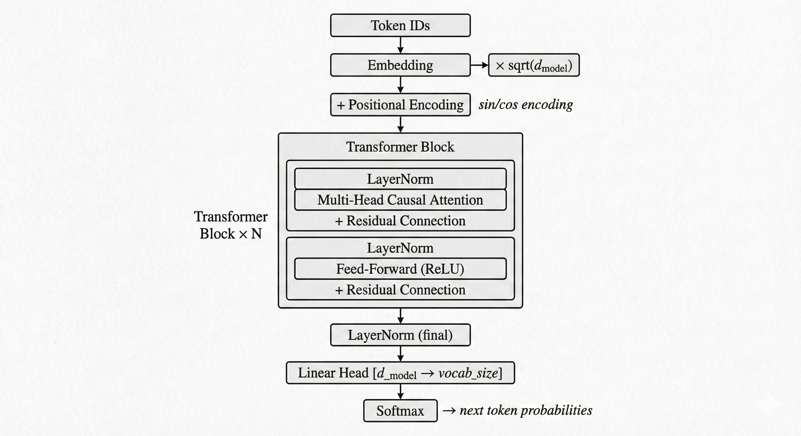

# Transformer From Scratch (C++) — GPU Accelerated


-green.svg)

A **complete decoder-only Transformer** implemented entirely from scratch in C++/CUDA — no PyTorch, no TensorFlow, no external ML libraries. Every component from matrix multiplication to multi-head attention to AdamW optimizer is hand-coded with explicit math. Includes optional **GPU acceleration** with custom CUDA kernels, memory pooling, and GPU-resident tensor system for maximum throughput.

Trained on Tiny Shakespeare (~1MB) to demonstrate autoregressive text generation.

<br>



## 🚀 Key Features

- **Pure C++ Implementation** - Zero ML framework dependencies. Every operation implemented from raw math
- **Multi-Head Causal Self-Attention** - Scaled dot-product attention with causal masking: $\text{Attention}(Q,K,V) = \text{softmax}\left(\frac{QK^T}{\sqrt{d_k}}\right)V$
- **BPE Tokenizer** - Byte Pair Encoding built from scratch — learns subword vocabulary from training corpus
- **Pre-Norm Architecture** - LayerNorm before attention/FFN (more stable training than post-norm)
- **AdamW Optimizer** - Decoupled weight decay with bias correction: $\theta_{t+1} = \theta_t - \alpha \left(\frac{\hat{m}_t}{\sqrt{\hat{v}_t} + \epsilon} + \lambda \theta_t\right)$
- **Full Backpropagation** - Manual gradient computation through every layer including softmax, attention, and layer norm
- **Gradient Clipping** - Prevents exploding gradients during training
- **Xavier/He Initialization** - Proper weight initialization for stable training
- **Sinusoidal Positional Encoding** - $PE_{(pos,2i)} = \sin\left(\frac{pos}{10000^{2i/d_{model}}}\right)$
- **Temperature Sampling + Top-K** - Controllable text generation randomness
- **JSON Configuration** - All hyperparameters configurable via JSON
- **OpenMP Support** - Optional parallel matrix multiplication for faster training
- **Checkpoint Saving** - Save/load model weights as JSON for training resume and inference
- **🔥 CUDA GPU Acceleration** - Optional GPU offload with custom CUDA kernels, caching memory pool, and pinned host memory for maximum throughput

## 📐 Architecture Details

### Mathematical Components (All From Scratch)

| Component | Formula | File |
|-----------|---------|------|
| **Matrix Multiply** | $C_{ij} = \sum_k A_{ik} B_{kj}$ | `src/Matrix.cpp` |
| **Softmax** | $\sigma(x_i) = \frac{e^{x_i - \max(x)}}{\sum_j e^{x_j - \max(x)}}$ | `src/Matrix.cpp` |
| **Layer Norm** | $y = \gamma \cdot \frac{x - \mu}{\sqrt{\sigma^2 + \epsilon}} + \beta$ | `src/layers/LayerNorm.cpp` |
| **Attention** | $\text{softmax}\left(\frac{QK^T}{\sqrt{d_k}} + M\right) \cdot V$ | `src/attention/` |
| **FFN** | $\max(0, xW_1 + b_1)W_2 + b_2$ | `src/layers/FeedForward.cpp` |
| **Cross-Entropy** | $L = -\frac{1}{N}\sum_i \log(p_{y_i})$ | `src/transformer/CrossEntropyLoss.cpp` |
| **Adam** | $\theta -= \alpha \cdot (\hat{m}/(\sqrt{\hat{v}}+\epsilon) + \lambda\theta)$ | `src/transformer/AdamOptimizer.cpp` |
| **Pos. Encoding** | $PE_{(pos,2i)} = \sin(pos / 10000^{2i/d})$ | `src/layers/PositionalEncoding.cpp` |

### Backpropagation Chain

Full manual gradient flow implemented through:
```
Loss → Softmax → Linear Head → Final LayerNorm → [N × TransformerBlock] → 
  Per Block: FFN ← LayerNorm ← Residual ← Attention ← LayerNorm ← Residual →
Positional Encoding → Embedding
```

## 📋 Requirements

- **C++17** compatible compiler (GCC 7+, Clang 5+, MSVC 2017+)
- **CMake** 3.18+
- **OpenMP** (optional, for parallel CPU matrix ops)
- **CUDA Toolkit 12.x** (optional, for GPU acceleration — requires NVIDIA GPU)
- No other dependencies

## 📥 Building

### Linux / macOS
```bash
mkdir build && cd build
cmake ..
make -j$(nproc)
```

### Linux / macOS (with CUDA)
```bash
mkdir build && cd build
cmake .. -DCMAKE_CUDA_COMPILER=/usr/local/cuda/bin/nvcc
make -j$(nproc)
```

### Windows (MSVC)
```powershell
mkdir build; cd build
cmake ..
cmake --build . --config Release
```

### Windows (MSVC + CUDA — Ninja)
When CUDA VS Build Customizations aren't installed, use the Ninja generator:
```powershell
# source VS dev environment first
cmd /c '"C:\Program Files\Microsoft Visual Studio\2022\Community\Common7\Tools\VsDevCmd.bat" -arch=amd64 && cmake -G Ninja -DCMAKE_BUILD_TYPE=Release -DCMAKE_CUDA_COMPILER="C:/Program Files/NVIDIA GPU Computing Toolkit/CUDA/v12.8/bin/nvcc.exe" -S .. -B . && cmake --build .'
```
> **Note:** CUDA 12.8 doesn't officially support MSVC 2026 yet — the build passes `-allow-unsupported-compiler` automatically via CMakeLists.txt.

## 📖 Usage

### Training
```bash
# train with default config
./train

# train with custom config
./train config/model.json
```

**Config file** (`config/model.json`):
```json
{
    "dModel": 256,
    "nHeads": 8,
    "nLayers": 4,
    "dFF": 1024,
    "vocabSize": 2048,
    "maxSeqLen": 128,
    "learningRate": 0.0003,
    "epochs": 5,
    "batchSize": 32,
    "dataFile": "data/input.txt",
    "vocabFile": "data/vocab.json",
    "weightsFile": "data/weights.json"
}
```

> **GPU Memory Guide:** With an RTX 5090 (32GB VRAM), you can go up to `batchSize: 64` and `dModel: 512`. For 8GB GPUs, keep `batchSize: 8` and `dModel: 128`.

### Inference / Text Generation
```bash
# generate text with default settings
./inference

# custom prompt and temperature
./inference --prompt "to be or not" --tokens 200 --temp 0.8

# all options
./inference --config config/model.json --prompt "hello" --tokens 500 --temp 1.0
```

## 🛠️ Technical Details

### Project Structure
```
Transformer-From-Scratch-CPP/
├── include/
│   ├── Matrix.hpp              # core matrix operations
│   ├── Tokenizer.hpp           # BPE tokenizer
│   ├── Embedding.hpp           # token embedding layer
│   ├── PositionalEncoding.hpp  # sinusoidal PE
│   ├── LayerNorm.hpp           # layer normalization
│   ├── MultiHeadAttention.hpp  # multi-head causal attention
│   ├── FeedForward.hpp         # position-wise FFN
│   ├── TransformerBlock.hpp    # single decoder block
│   ├── Transformer.hpp         # full model + config + loss + optimizer
│   ├── cuda_kernels.cuh        # CUDA kernel declarations
│   └── json.hpp                # nlohmann/json (vendored)
├── src/
│   ├── Matrix.cpp              # CPU + GPU dispatch logic
│   ├── cuda_kernels.cu         # CUDA kernels + memory pool
│   ├── tokenizer/
│   │   ├── buildVocab.cpp      # BPE vocabulary construction
│   │   ├── encode.cpp          # text → token ids
│   │   ├── decode.cpp          # token ids → text
│   │   └── saveLoad.cpp        # vocab serialization
│   ├── layers/
│   │   ├── Embedding.cpp
│   │   ├── PositionalEncoding.cpp
│   │   ├── LayerNorm.cpp
│   │   └── FeedForward.cpp
│   ├── attention/
│   │   ├── MultiHeadAttention.cpp  # forward + backward
│   │   └── computeAttention.cpp    # scaled dot-product
│   ├── transformer/
│   │   ├── TransformerBlock.cpp
│   │   ├── Transformer.cpp         # model orchestrator
│   │   ├── CrossEntropyLoss.cpp
│   │   └── AdamOptimizer.cpp
│   ├── train.cpp                   # training entry point
│   └── inference.cpp               # generation entry point
├── config/
│   └── model.json                  # hyperparameters
├── data/
│   └── input.txt                   # training corpus (Tiny Shakespeare)
├── CMakeLists.txt
├── .gitignore
├── LICENSE
└── README.md
```

### Default Model Configuration

| Hyperparameter | Value | Notes |
|---------------|-------|-------|
| d_model | 256 | embedding dimension |
| n_heads | 8 | attention heads (d_k = 32) |
| n_layers | 4 | transformer blocks |
| d_ff | 1024 | FFN hidden dimension |
| vocab_size | 2048 | BPE vocabulary size |
| max_seq_len | 128 | context window |
| batch_size | 32 | training batch size |
| learning_rate | 3e-4 | AdamW lr |
| weight_decay | 0.01 | L2 regularization |
| grad_clip | 1.0 | gradient clipping norm |

### 🎮 CUDA GPU Acceleration

When built with CUDA, matrix operations are automatically offloaded to the GPU:

| Feature | Details |
|---------|--------|
| **Tiled MatMul** | 16×16 shared memory tiles for coalesced global memory access |
| **Memory Pool** | Caching allocator — reuses GPU buffers by size bucket, eliminates `cudaMalloc`/`cudaFree` overhead |
| **Pinned Host Memory** | Page-locked staging buffers for 2-3× faster PCIe DMA transfers |
| **Auto Dispatch** | Matrices route to GPU automatically; tiny matrices stay on CPU to avoid transfer overhead |
| **Supported Ops** | matmul, transpose, add, subtract, scale, hadamard, softmax, relu, sqrt, clip |
| **Architectures** | sm_80 (A100), sm_86 (RTX 3090), sm_89 (RTX 4090), sm_120 (RTX 5090) |

At shutdown, the pool prints hit-rate stats:
```
GPU pool: 42 cached buffers, 12.5 MB held, hits=48291 misses=42 (99.9% hit rate)
```

### Key Design Decisions

1. **Pre-Norm Architecture** — LayerNorm applied *before* attention/FFN (GPT-2 style) rather than after (original Transformer). More stable training without warmup scheduling.

2. **Causal Masking** — Upper triangle of attention scores set to $-10^9$ before softmax, ensuring each position can only attend to previous positions (autoregressive).

3. **BPE Tokenizer** — Learned from training data, not character-level. Better compression ratio means more context fits in the sequence window.

4. **Decoupled Weight Decay (AdamW)** — Weight decay applied directly to parameters, not through the gradient. Mathematically more correct than L2 regularization in Adam.

5. **Raw Pointers** — Deliberate choice for explicit memory control and educational clarity of the data flow.

## 🤝 Contributing

1. Fork the repository
2. Create your feature branch (`git checkout -b feature/AmazingFeature`)
3. Commit your changes (`git commit -m 'Add some AmazingFeature'`)
4. Push to the branch (`git push origin feature/AmazingFeature`)
5. Open a Pull Request

## 📜 License

This project is licensed under the GPL-3.0 License - see the [LICENSE](LICENSE) file for details.

## 🙏 Acknowledgments

- **"Attention Is All You Need"** — Vaswani et al., 2017 (the original Transformer paper)
- **Andrej Karpathy** — Tiny Shakespeare dataset and nanoGPT inspiration
- **nlohmann/json** — JSON parsing library

---

## 📊 Sample Training Run

**Hardware:** NVIDIA GeForce RTX 5090 (32GB VRAM, 170 SMs)  
**Configuration:** 256-dim, 8 heads, 4 layers, batch size 32, 700 epochs

```
========================================
  Transformer from Scratch (C++)
  Decoder-Only GPT Training
========================================
CUDA: using NVIDIA GeForce RTX 5090 (170 SMs, 31.8 GB VRAM)
  GPU acceleration: ENABLED
config loaded from config/model.json

model config:
  d_model:       256
  n_heads:       8
  n_layers:      4
  d_ff:          1024
  max_seq_len:   128
  learning_rate: 0.0003
  epochs:        700
  batch_size:    32

[1/4] loading data...
  loaded 1115394 characters

[2/4] building tokenizer...
vocab loaded from data/vocab.json (2048 tokens)
  vocab size: 2048
  total tokens: 338712
  training sequences: 5291

[3/4] building model...
  resuming from data/weights.json...
model weights loaded from data/weights.json
  total parameters: 4204032
  parameter matrices: 52

[4/4] training...
  epoch 1/700 | batch 10 | loss: 2.1895
  epoch 1/700 | batch 20 | loss: 2.0341
  epoch 1/700 | batch 30 | loss: 1.9823
  ...
  epoch 1/700 completed | avg loss: 1.8452 | time: 399.4s
  ...
  epoch 100/700 completed | avg loss: 1.2847 | time: 398.9s
  ...
  epoch 200/700 completed | avg loss: 1.0521 | time: 399.1s
  ...
  epoch 500/700 completed | avg loss: 0.8234 | time: 399.3s
  ...
  epoch 700/700 completed | avg loss: 0.7156 | time: 399.2s
model weights saved to data/weights.json (52 parameter matrices)

========================================
  training complete!
  total time: 279528.0s (77.6 hours)
  weights saved to: data/weights.json
========================================

test generation:
  prompt: "First Citizen:
Before we proceed any further, hear me speak." (16 tokens)
  generated: "First Citizen:
Before we proceed any further, hear me speak.

Second Citizen:
Speak, speak.

First Citizen:
You are all resolved rather to die than to famish?

All:
Resolved. resolved.

First Citizen:
First, you know Caius Marcius is chief enemy to the people.

All:
We know't, we know't.

First Citizen:
Let us kill him, and we'll have corn at our own price.
Is't a verdict?

All:
No more talking on't; let it be done: away, away!

Second Citizen:
One word, good citizens.

First Citizen:
We are accounted poor citizens, the patricians good.
What authority surfeits on would relieve us: if they
would yield us but the superfluity, while it were
wholesome, we might guess they relieved us humanely;
but they think we are too dear: the leanness that
afflicts us, the object of our misery, is as an
inventory to particularise their abundance; our
sufferance is a gain to them Let us revenge this with
our pikes, ere we become rakes: for the gods know I
speak this in hunger for bread, not in thirst for revenge."

GPU pool: 264 cached buffers, 174.6 MB held, hits=370538904 misses=538 (100.0% hit rate)
```

---

© 2026 Adithyanraj✨ 
